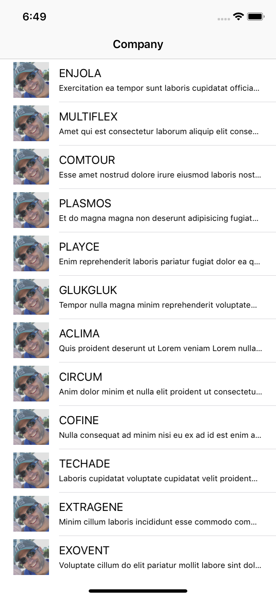
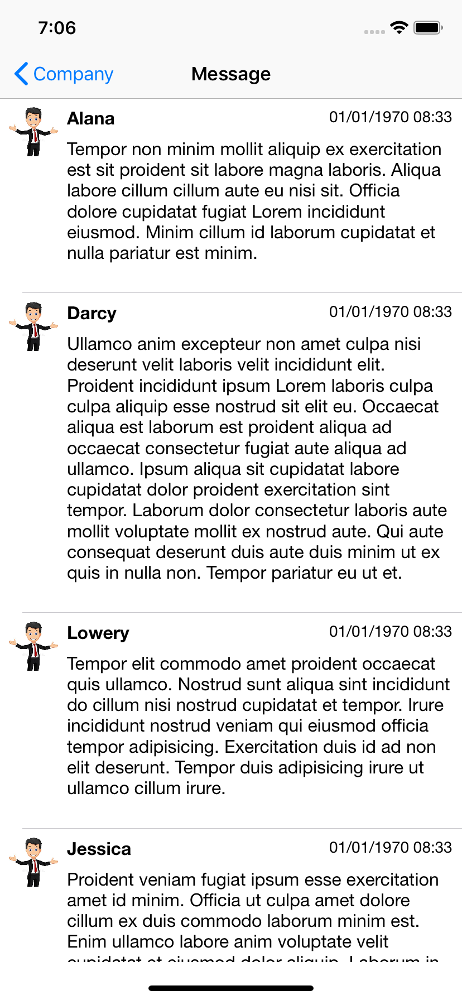

# Elastic
App show twitter message about some companies in the world. 
## Setup
Clone project.
```
cd /path/to/store
git clone https://github.com/hiensiga/Elastic
``` 
### CocoaPods
[CocoaPods](https://cocoapods.org/) is a dependency manager for Cocoa projects. You can install it with the following command:
```bash
$ gem install cocoapods
```

> CocoaPods 1.1+ is required to build Alamofire 4.0+.

#### Alamofire
To integrate Alamofire into your Xcode project using CocoaPods, specify it in your `Podfile`:

```ruby
pod 'Alamofire', '4.8.0'
```

Then, run the following command:
```bash
$ pod install
```
#### SwiftLint
A tool to enforce Swift style and conventions, loosely based on  [GitHub's Swift Style Guide](https://github.com/github/swift-style-guide).

SwiftLint hooks into  [Clang](http://clang.llvm.org/)  and  [SourceKit](http://www.jpsim.com/uncovering-sourcekit)  to use the  [AST](http://clang.llvm.org/docs/IntroductionToTheClangAST.html)  representation of your source files for more accurate results.
##### Using  [CocoaPods](https://cocoapods.org/):

Simply add the following line to your Podfile:

pod 'SwiftLint'


## Screen Shot




